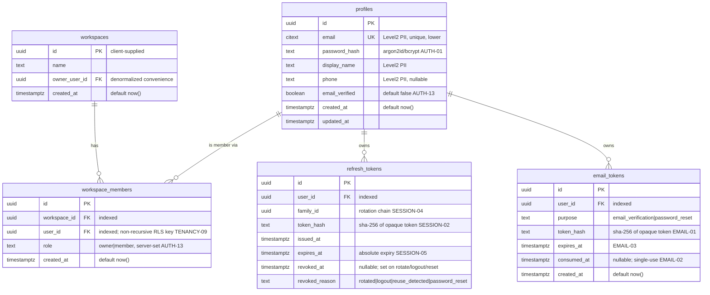

# RiMi Contracts — Phase 1 (Foundation)

Authoritative design artifacts for Phase 1 (AUTH-01..07). Implementers (Go backend,
Flutter) build against these and the Security rules in
`docs/security/phase-1-auth-workspace.md`. This is contract-mode output: design,
data model, JWT spec, and ADRs only — no implementation.

| Artifact | File |
|----------|------|
| OpenAPI 3.1 spec (all endpoints + error catalog) | `auth-workspace.yaml` |
| Data model / ERD | this file, §2 |
| JWT & refresh-token design | this file, §3 |
| ADR-001 active-workspace as signed JWT claim | this file, §4 |
| ADR-002 two-role RLS enforcement | this file, §5 |
| Error-code catalog | this file, §6 |
| AUTH-01..07 traceability | this file, §7 |

---

## 1. Conventions

- JSON fields & query params: `snake_case`. URL paths: `kebab-case`. Error codes:
  `SCREAMING_SNAKE_CASE`. Schema/model names: `PascalCase`.
- Every HTTP response uses the mandatory envelope (project `patterns.md`):
  - Success: `{ "data": <payload>, "meta": { "timestamp": "<iso8601>" } }`
  - Error: `{ "error": { "code": "<CODE>", "message": "<human>", "details": [] } }`
- Money columns (later phases): `NUMERIC(15,2)`. PKs: client-supplied `uuid`
  (offline-first). `created_at timestamptz DEFAULT now()` (server clock).

---

## 2. Data model (Phase-1-relevant tables)

All workspace-scoped tables carry `workspace_id uuid NOT NULL`, an index on
`workspace_id` (TENANCY-11), `ENABLE ROW LEVEL SECURITY` + ≥1 restrictive policy
in the SAME migration that creates them (TENANCY-01). `profiles`, `refresh_tokens`,
and `email_tokens` are scoped to a **user** rather than a workspace (a user exists
before any workspace) — their RLS keys on `rimi.user_id`, not `rimi.workspace_id`.

### ERD (Phase 1)



### Column / constraint notes

- `profiles.email` — store as `citext` (or `text` with a `UNIQUE` index on
  `lower(email)`) so login lookups are case-insensitive and the unique constraint
  is the anti-duplicate guard. Never logged raw (PII-01).
- `profiles.password_hash` — argon2id (preferred) or bcrypt, tuned ≈250ms
  (AUTH-01). No plaintext password column ever.
- `workspace_members (workspace_id, user_id)` — `UNIQUE` (one membership row per
  user per workspace). Flat M:N, no nesting. Indexes on both FKs.
- `refresh_tokens.token_hash` — store the SHA-256 of the opaque token, never the
  raw token (SESSION-02). `family_id` groups a rotation chain; reuse of a revoked
  token revokes the whole `family_id` (SESSION-04). Index on
  `(token_hash)` for lookup and `(user_id, family_id)` for family revocation.
- `email_tokens.token_hash` — SHA-256 of the raw token (EMAIL-01). `purpose`
  discriminates verification vs reset (single table keeps the model small).
  `consumed_at` enforces single-use (EMAIL-02); `expires_at` enforces expiry
  (EMAIL-03). Index on `(token_hash)`.
- All later-phase tables (§2.1) also get `id uuid PK`, `workspace_id uuid NOT NULL`
  + index, `created_at` default, money as `NUMERIC(15,2)`, and RLS+policy in the
  creating migration.

### 2.1 All-tables-upfront migration scope

The Phase-1 schema migration creates the FULL 8-phase core table set so later
phases add columns/logic via `ALTER TABLE`, not new core tables, and the hardened
`rowsecurity` CI gate (TENANCY-04) is enforced from day one. Tables to create now
(Phase-1 logic only touches the first group):

- **Phase 1 (active logic):** `profiles`, `workspaces`, `workspace_members`,
  `refresh_tokens`, `email_tokens`.
- **Phase 3 (products/inventory):** `products`, `product_variants`,
  `product_channel_overrides`, `inventory_items`, `inventory_adjustments`.
- **Phase 4 (orders):** `orders`, `order_items`, `order_status_events`,
  `channel_order_refs` (platform-id dedup, ORD-11).
- **Phase 5 (CRM):** `customers`, `customer_notes`.
- **Phase 6 (finance/payments):** `transactions`, `income_entries`,
  `expense_entries`, `receivables`, `payment_records`, `bank_transfers`.
- **Phase 7 (AI):** `ai_usage`.
- **Phase 2/8 (e-invoice, optional):** `einvoices`, `einvoice_line_items`.

> The exact columns of later-phase tables are out of Phase-1 design scope; only
> the table names, `workspace_id`+index, PK, `created_at`, and RLS+policy are
> mandated now. Their detailed contracts are produced when their phase is planned.

---

## 3. JWT & refresh-token design

### Access token (RS256 JWT, ~15 min)

Decoded payload (see `AccessTokenClaims` in `auth-workspace.yaml`):

```json
{
  "iss": "rimi-auth",
  "aud": "rimi-api",
  "sub": "<user-uuid>",
  "iat": 1717142400,
  "exp": 1717143300,
  "workspace_id": "<workspace-uuid> | null"
}
```

- **Signing:** RS256 only (AUTH-10). Private key from env/secret store, never
  committed, never on device (SECRETS-01/03). Header carries `kid` to support
  rotation; the verifier holds ≥2 public keys during a rollover (SECRETS-02).
- **Verification (AUTH-11):** pin `alg=RS256`; reject `none`/HS256/any mismatch;
  validate signature, `exp`, `iss`, `aud`.
- **`workspace_id` claim:**
  - `null` for a user with no workspace. Workspace-scoped endpoints then return
    empty because the `rimi.workspace_id` GUC is set to NULL and policies fail
    closed (TENANCY-07).
  - Set to the created/selected workspace at `POST /workspaces` and
    `POST /workspaces/{id}/switch` (SESSION-08). This is the ONLY way the claim
    changes — it is server-asserted after a membership check, never read from a
    client header/body/query (CLIENT-04, ADR-001).
  - `sub` → `rimi.user_id` GUC; `workspace_id` → `rimi.workspace_id` GUC, set with
    `SET LOCAL` at the start of each request transaction (TENANCY-06).
- **Lifetime:** `exp - iat ≈ 900s` (AUTH-12). The access token is NOT the
  revocation surface — long-lived revocable state lives in `refresh_tokens`.

### Refresh token — RECOMMENDED: opaque, not JWT

**Recommendation: opaque high-entropy token, stored hashed.** Rationale:

- SESSION-02 mandates *hashed at rest*. A JWT is self-describing and can't be
  meaningfully one-way-hashed for server-side validation without defeating its
  purpose; an opaque random string maps cleanly to a `token_hash` column.
- SESSION-01/03/04/06 require durable, server-revocable, rotating, family-tracked
  tokens. That is inherently stateful — a stateless JWT refresh token fights every
  one of those rules. Opaque + DB row is the natural fit.

Model:

- **Generation:** ≥256-bit CSPRNG, base64url-encoded (SESSION-05, exceeds the
  128-bit floor). Raw value returned to the client once; only its SHA-256 hash is
  stored (SESSION-02).
- **Storage:** client keeps it in secure storage only (CLIENT-01); server stores
  `token_hash` + `family_id` + `expires_at` + `revoked_at`/`revoked_reason`.
- **Rotation (SESSION-03):** `/auth/refresh` atomically marks the presented row
  `revoked_at=now(), revoked_reason='rotated'` and inserts a new row in the SAME
  `family_id`, returning a new opaque token + a fresh access token.
- **Reuse detection (SESSION-04):** if the presented token's row is already
  revoked → theft. Revoke the entire `family_id`, reject with
  `REFRESH_TOKEN_REUSED`, emit a high-severity audit event (LOG-02).
- **Absolute expiry (SESSION-05):** every row has `expires_at`; expired → reject.
- **Logout (SESSION-06):** revoke the presented token's family.
- **Password reset (AUTH-09):** revoke ALL of the user's families.
- **Workspace switch/create:** the refresh token is **session-scoped, not
  workspace-scoped** → it is NOT rotated on switch/create. Only the access token
  is re-issued with the new `workspace_id` claim. (Re-rotating refresh on every
  switch would create false reuse-detection races with the client's single-flight
  refresh, CLIENT-03.)

### Token lifetimes summary

| Token | Lifetime | Revocable | At rest |
|-------|----------|-----------|---------|
| Access JWT | ~15 min (AUTH-12) | No (short TTL) | not stored |
| Refresh (opaque) | absolute expiry, e.g. 30–90d (SESSION-05) | Yes, family-wide | SHA-256 hash (SESSION-02) |
| Email-verification | hours (EMAIL-03) | single-use (EMAIL-02) | SHA-256 hash (EMAIL-01) |
| Password-reset | ~15–60 min (EMAIL-03) | single-use (EMAIL-02) | SHA-256 hash (EMAIL-01) |

---

## 4. ADR-001 — Active workspace carried as a signed JWT claim

**Status:** Accepted (2026-05-31). Locked by the Phase-1 plan; security-confirmed.

**Problem.** A user may belong to multiple workspaces. Every workspace-scoped
request needs an unambiguous, trustworthy "which workspace is this request acting
in?" signal. The client must not be able to forge or widen that scope.

**Options considered.**
1. **Client-supplied header/body `workspace_id`** per request. Simple, stateless on
   the server. **Rejected:** it is client-controlled authorization input — exactly
   the broken-access-control pattern (F-08/F-09). Trusting it for scoping violates
   TENANCY-05/08 and SESSION-08.
2. **Server-side session record of "active workspace"** keyed by session id.
   Works, but adds a stateful read on every request and a second source of truth
   alongside the JWT; couples scoping to session storage availability.
3. **Active workspace as a signed JWT claim, re-issued at `/switch`** (chosen).

**Decision.** The active workspace is the `workspace_id` claim in the RS256 access
token. It is set only by `POST /workspaces` (create → owner) and
`POST /workspaces/{id}/switch`, each of which verifies membership before
re-issuing the token. `/switch` is the SOLE membership gate (TENANCY-08). The
server NEVER reads active-workspace from a client header/body/query (SESSION-08).
A user with no workspace has `workspace_id: null`.

**Consequences.**
- (+) Scope is cryptographically bound to a server-asserted, signed value; a forged
  header is ignored. Stateless per-request scoping (no session read).
- (+) The membership check happens once at switch, not on every request; per-request
  cost is just JWT verification + `SET LOCAL`.
- (−) Switching workspace requires a token round-trip and the client must replace
  its access token (handled in the Flutter switcher, plan B5).
- (−) The active workspace changes only at access-token issuance granularity; a
  membership revoked mid-session is still honored until the ~15 min access token
  expires. Accepted: 15-min blast radius, and `/switch`/refresh re-check membership.
- Defense-in-depth: even if the claim were wrong, RLS (`SET LOCAL` GUC + policies)
  and the app-layer guard independently scope every query (TENANCY-05/06).

---

## 5. ADR-002 — Two-role RLS enforcement (restricted app role + owner migrator)

**Status:** Accepted (2026-05-31). Locked by the Phase-1 plan; security-confirmed
(TENANCY-02/03).

**Problem.** Postgres RLS is the day-one tenancy boundary (AUTH-07). But Postgres
**does not apply RLS to table owners or superusers, and skips it for `BYPASSRLS`
roles**. A table can show `rowsecurity=true` and still leak every row if the app
connects as the owner/superuser — the #1 way self-hosted RLS ships silently broken
(F-11).

**Options considered.**
1. **Single DB role** that owns tables and runs the app. Simplest. **Rejected:**
   the owner bypasses RLS; the isolation guarantee is void.
2. **App connects as a non-owner restricted role; a separate owner role runs
   migrations** (chosen).
3. App-layer scoping only (no RLS). **Rejected:** a single missed `WHERE
   workspace_id =` leaks across tenants; no defense-in-depth.

**Decision.** Two roles:
- `rimi_migrator` — owns the schema, runs migrations (DDL).
- `rimi_app` — `LOGIN NOSUPERUSER NOBYPASSRLS`, **not** a table owner; the
  application connects as this role so RLS is genuinely enforced (TENANCY-02).
Both credentials come from env/secret store, never committed (TENANCY-03). Policies
use `SET LOCAL rimi.user_id`/`rimi.workspace_id` GUCs (TENANCY-06), fail closed when
unset (TENANCY-07), `workspace_members` uses a non-recursive own-row policy
(TENANCY-09), all other tables use a `SECURITY DEFINER app.is_workspace_member()`
with a pinned `search_path` (TENANCY-10).

**Consequences.**
- (+) `rowsecurity=true` is now backed by real enforcement; the CI gate also asserts
  `rimi_app` is `rolsuper=false`, `rolbypassrls=false`, non-owner, and every public
  table has ≥1 policy (TENANCY-04).
- (+) Defense-in-depth with the app-layer `workspace_id` guard (TENANCY-05).
- (−) Two roles to provision and two credential sets to manage; migrations and the
  app use different connections. Accepted — this is the cost of correct RLS.
- (−) `SECURITY DEFINER` function must pin `search_path` (TENANCY-10) or it becomes
  an EoP vector (F-29).

---

## 6. Error-code catalog

All codes are `SCREAMING_SNAKE_CASE`, returned in `error.code`. 22 codes.

| Code | HTTP | Endpoint(s) | Meaning / security rule |
|------|------|-------------|--------------------------|
| `VALIDATION_ERROR` | 400 | all writes | Boundary validation failed (INPUT-03/04). `details[]` lists fields. |
| `WEAK_PASSWORD` | 400 | password-reset/confirm, (register*) | Password below policy (AUTH-05). |
| `UNAUTHORIZED` | 401 | /auth/me, /workspaces* | Missing/invalid/expired access token (AUTH-11). |
| `INVALID_CREDENTIALS` | 401 | /auth/login | Generic auth failure — wrong password, unknown account, or unverified, indistinguishable (AUTH-02/03). |
| `REFRESH_TOKEN_INVALID` | 401 | /auth/refresh | Refresh token unknown, expired, or revoked (SESSION-01/05). |
| `REFRESH_TOKEN_REUSED` | 401 | /auth/refresh | Revoked token replayed → family revoked (SESSION-04, LOG-02). Same client message as INVALID. |
| `WORKSPACE_FORBIDDEN` | 403 | /workspaces/{id}/switch | Caller is not a member (TENANCY-08). |
| `WORKSPACE_NOT_FOUND` | 404 | /workspaces/{id}/switch | Workspace absent. MAY be collapsed into WORKSPACE_FORBIDDEN to avoid existence leak. |
| `TOKEN_INVALID_OR_EXPIRED` | 410 | verify-email, password-reset/confirm | Email/reset token invalid, used, or expired (EMAIL-02/03). |
| `WORKSPACE_ID_CONFLICT` | 409 | POST /workspaces | Client-supplied workspace id already exists (offline-first idempotency). |
| `PAYLOAD_TOO_LARGE` | 413 | register, create workspace | Body over size cap (INPUT-05). |
| `RATE_LIMITED` | 429 | auth endpoints | Too many requests (RATE-01/02/03). |
| `ACCOUNT_LOCKED` | 429 | /auth/login | Per-account lockout/backoff (AUTH-04); non-enumerating. |
| `INTERNAL_ERROR` | 500 | all | Generic server error; no internals leaked (INPUT-06, LOG-04). |
| `SERVICE_UNAVAILABLE` | 503 | /health | Dependency (DB) unreachable. |

\* `WEAK_PASSWORD` on register is OPTIONAL: to preserve anti-enumeration (AUTH-03),
register returns `202 { registered: true }` even for an existing email, so a weak
password on register MAY instead surface as `VALIDATION_ERROR` before the
existence check. Implementers MUST keep register's success path non-enumerating.

> Reserved (referenced by responses, not yet a distinct path beyond the table):
> `SERVICE_UNAVAILABLE` is the only `/health` failure code.

---

## 7. AUTH-01..07 → endpoint traceability

| Req | Endpoints | Notes |
|-----|-----------|-------|
| AUTH-01 signup | `POST /auth/register` | bcrypt/argon2 hash; server-set fields (AUTH-13). |
| AUTH-02 email verify | `POST /auth/register` (sends), `POST /auth/verify-email` (consumes) | Single-use hashed token. |
| AUTH-03 password reset | `POST /auth/password-reset/request`, `POST /auth/password-reset/confirm` | Anti-enum request; all-sessions revoke on confirm (AUTH-09). |
| AUTH-04 session persists | `POST /auth/login`, `POST /auth/refresh`, `POST /auth/logout`, `GET /auth/me` | Rotating opaque refresh + 15m RS256 access; client bootstrap via /auth/me. |
| AUTH-05 create workspace | `POST /workspaces` | Owner membership row + new scoped access token. |
| AUTH-06 switch workspace | `GET /workspaces`, `POST /workspaces/{id}/switch` | Sole membership gate; re-issues access token. |
| AUTH-07 data isolation | (cross-cutting) all `/workspaces*` + every later workspace-scoped read | Enforced by RLS (GUC + policies) + app guard; see §2, ADR-002. |

Every AUTH-01..07 maps to ≥1 endpoint.

---

## 8. Open flags for the orchestrator (no silent overrides)

1. **Email/reset deep-link strategy** is unresolved in the plan (custom scheme vs
   App/Universal Links vs interim "paste code"). The contract is agnostic: the
   confirm/verify endpoints take the token in the request **body** (EMAIL-06),
   which works for any delivery mechanism. Pick the client delivery before Flutter
   B4; it does not change this contract.
2. **`register` returns 202, not 200.** Chosen because the verification email is
   dispatched asynchronously and the account is not yet usable (login is blocked
   until verified). If the orchestrator prefers 200 for client simplicity, that is
   a cosmetic change — flag, not a blocker.
3. **`WORKSPACE_NOT_FOUND` (404) vs `WORKSPACE_FORBIDDEN` (403)** on `/switch`:
   exposing 404 to non-members technically leaks workspace existence. The contract
   permits collapsing 404 into 403 to close that leak; recommended default is to
   return 403 for both "not a member" and "does not exist". No Security rule
   strictly requires this, so it is left as an implementer choice with a documented
   recommendation rather than a hard mandate.

No Security rule conflicts with this contract.

---
*Last updated: 2026-05-31*
